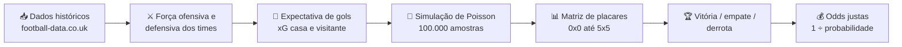

# ⚽ Analisador de Odds de Futebol


> Ferramenta em Python que aplica um modelo estatístico baseado na distribuição de Poisson sobre dados históricos reais de futebol para estimar probabilidades de vitória, empate e derrota convertendo-as em odds justas para comparação direta com casas de apostas.

## 📑 Sumário

- [Sobre o projeto](#sobre-o-projeto)
- [Como funciona](#como-funciona)
- [Tecnologias utilizadas](#tecnologias-utilizadas)
- [Fonte de dados](#fonte-de-dados)
- [Instalação](#instalação)
- [Como usar](#como-usar)
- [Exemplo de execução](#exemplo-de-execução)
- [Estrutura do projeto](#estrutura-do-projeto)
- [Limitações e considerações do modelo](#limitações-e-considerações-do-modelo)
- [Roadmap](#roadmap)
- [Aviso legal](#aviso-legal)
- [Licença](#licença)

## 🎯 Sobre o projeto

O **Analisador de Odds de Futebol** é uma ferramenta de linha de comando que combina dados esportivos reais com modelagem estatística para responder a uma pergunta bem objetiva: *dado o desempenho histórico dos dois times na temporada, o mercado de apostas está pagando mais do que deveria por este resultado?*

Em cada execução, o programa:

1. Baixa, em tempo real, os resultados da temporada de uma das 5 principais ligas europeias direto do [football-data.co.uk](https://www.football-data.co.uk/);
2. Calcula a força ofensiva e defensiva dos dois times escolhidos, relativas à média da liga;
3. Estima a expectativa de gols (xG) de cada time para o confronto;
4. Simula 100.000 partidas hipotéticas via distribuição de Poisson;
5. Converte o resultado em probabilidades de vitória / empate / derrota e nas respectivas **odds decimais justas**.

Não é uma "bola de cristal" é um exercício de estatística aplicada a dados reais, do tipo usado como base por casas de apostas e analistas esportivos profissionais.

## 🧠 Como funciona



### 1. Força de ataque e defesa

Cada time é comparado com a média da liga:

```text
Força de Ataque (casa)  = Média de gols marcados em casa pelo time  ÷ Média de gols marcados em casa na liga
Força de Defesa (casa)  = Média de gols sofridos em casa pelo time  ÷ Média de gols marcados fora na liga
Força de Ataque (fora)  = Média de gols marcados fora pelo time     ÷ Média de gols marcados fora na liga
Força de Defesa (fora)  = Média de gols sofridos fora pelo time     ÷ Média de gols marcados em casa na liga
```

Acima de `1.0` = acima da média da liga; abaixo de `1.0` = abaixo da média.

### 2. Expectativa de gols (xG)

O ataque de um lado é cruzado com a defesa do adversário:

```text
xG (casa)      = Força de Ataque (casa) × Força de Defesa (fora) × Média de gols em casa na liga
xG (visitante) = Força de Ataque (fora) × Força de Defesa (casa) × Média de gols fora na liga
```

### 3. Simulação de Monte Carlo

Em vez da fórmula fechada da distribuição de Poisson, o script gera **100.000 amostras aleatórias** (`numpy.random.poisson`) por time a partir do xG calculado, estimando empiricamente a probabilidade de cada time marcar de 0 a 5 gols.

### 4. Matriz de placares

As distribuições de casa e visitante são combinadas via produto externo, formando uma matriz 6×6 com a probabilidade de cada placar entre 0×0 e 5×5 — considerando os gols dos dois times independentes entre si.

### 5. Resultado final

| Resultado | Cálculo |
|---|---|
| Empate | Soma da diagonal da matriz (placares iguais) |
| Vitória em casa | Soma das células abaixo da diagonal |
| Vitória visitante | Soma das células acima da diagonal |
| Odd justa | `1 ÷ probabilidade` |

## 🛠️ Tecnologias utilizadas

| Tecnologia | Função no projeto |
|---|---|
| [Python 3](https://www.python.org/) | Linguagem principal |
| [pandas](https://pandas.pydata.org/) | Leitura, filtragem e agregação dos dados históricos |
| [NumPy](https://numpy.org/) | Simulação de Poisson e operações com matrizes |

## 📊 Fonte de dados

Os dados são carregados **diretamente da web, em tempo real**, a partir do [football-data.co.uk](https://www.football-data.co.uk/data.php) uma base pública e gratuita amplamente usada por analistas de futebol.

Hoje a liga analisada é definida pela URL usada no código-fonte:

| Código | Liga | País |
|---|---|---|
| `E0` | Premier League | 🇬🇧 Inglaterra |
| `SP1` | La Liga | 🇪🇸 Espanha |
| `D1` | Bundesliga | 🇩🇪 Alemanha |
| `I1` | Serie A | 🇮🇹 Itália |
| `F1` | Ligue 1 | 🇫🇷 França |

> 💡 Por padrão, o projeto usa a **Bundesliga** (`D1`). Para trocar de liga, substitua o código `D1` na variável `url` pelo código correspondente na tabela acima.

## ⚙️ Instalação

```bash
# 1. Clone o repositório
git clone https://github.com/<seu-usuario>/<seu-repositorio>.git
cd <seu-repositorio>

# 2. (Recomendado) crie um ambiente virtual
python -m venv venv
source venv/bin/activate        # Windows: venv\Scripts\activate

# 3. Instale as dependências
pip install pandas numpy
```

**Pré-requisitos:** Python 3.8 ou superior e conexão com a internet (os dados são baixados a cada execução).

> 💡 Dica: crie um arquivo `requirements.txt` com `pandas` e `numpy` para facilitar a instalação em outras máquinas.

## ▶️ Como usar

1. *(Opcional)* Escolha a liga desejada trocando o código na URL — veja a tabela em [Fonte de dados](#fonte-de-dados).
2. Execute o script:

   ```bash
   python precificador_futebol.py
   ```

3. O programa exibirá a lista de times disponíveis na temporada carregada.
4. Digite o time da casa e o visitante **exatamente como aparecem na lista** (o padrão de nomes é o do football-data.co.uk, que às vezes difere do nome oficial do clube — ex.: `Man United`, `M'gladbach`).
5. O programa retorna a expectativa de gols, a matriz de probabilidades e as odds justas para os três resultados possíveis.

## 🖥️ Exemplo de execução

> 📌 **Exemplo ilustrativo** — os valores abaixo demonstram o formato da saída do programa. Os números reais mudam a cada execução, de acordo com os dados mais atuais disponíveis na fonte.

```text
------------Analisador de Odds------------

Times disponíveis na base de dados:
Augsburg, Bayern Munich, Dortmund, Ein Frankfurt, Leverkusen, Mainz, RB Leipzig, Stuttgart, Wolfsburg, ... (lista completa depende da temporada carregada)
--------------------------------------------------
Digite o nome do time da CASA: Bayern Munich
Digite o nome do time VISITANTE: Dortmund

[OK] Analise: Bayern Munich vs Dortmund...
Expectativa de gols: Bayern Munich 2.34 x 1.12 Dortmund.
 
Matriz utilizada para calculo das probabilidades: 
       0      1      2      3      4      5
0  0.031  0.035  0.020  0.007  0.002  0.000
1  0.073  0.082  0.046  0.017  0.005  0.001
2  0.086  0.096  0.054  0.020  0.006  0.001
3  0.067  0.075  0.042  0.016  0.004  0.001
4  0.039  0.044  0.025  0.009  0.003  0.001
5  0.018  0.020  0.011  0.004  0.001  0.000
--------------------------------------------------
RESULTADOS CALCULADOS: 
Vitória Bayern Munich: 61.0% (Odd: 1.64)
Empate: 18.6% (Odd: 5.38)
Vitória Dortmund: 16.6% (Odd: 6.02)
--------------------------------------------------
Compare essas Odds com as da sua casa de apostas.
Se a Odd da casa for maior que a calculada aqui, pode haver valor.
```

## 📁 Estrutura do projeto

```text
precificador_futebol/
├── precificador_futebol.py   # Script principal (coleta de dados, modelo estatístico e CLI)
└── README.md                 # Este arquivo
```

## ⚠️ Limitações e considerações do modelo

Ter clareza sobre as limitações de um modelo estatístico faz parte de usá-lo com responsabilidade:

- **Independência entre os gols dos dois times:** o modelo assume que os gols do mandante e do visitante são estatisticamente independentes. Na prática, placares baixos (0×0, 1×0, 1×1) têm uma leve correlação que este modelo não corrige ajuste conhecido na literatura como correção de Dixon-Coles.
- **Faixa de gols limitada:** a matriz de placares cobre apenas de 0 a 5 gols por time. Isso abrange a grande maioria dos jogos reais, mas deixa de fora a fração residual de placares elásticos.
- **Sem ponderação temporal:** todos os jogos da temporada têm o mesmo peso o modelo não prioriza a forma recente dos times.
- **Sensibilidade ao tamanho da amostra:** times recém-promovidos ou no início de temporada têm médias estatisticamente menos confiáveis.
- **Seleção de liga manual:** por enquanto, trocar de liga exige editar a URL diretamente no código.

## 🗺️ Roadmap

- [ ] Seleção interativa da liga (sem precisar editar a URL manualmente)
- [ ] Correção de Dixon-Coles para placares baixos
- [ ] Ponderação por forma recente (últimos N jogos, com decaimento exponencial)
- [ ] Cálculo automático do Kelly Criterion para dimensionamento de aposta
- [ ] Testes automatizados com `pytest`
- [ ] Tratamento de erros de rede e de dados ausentes ou incompletos
- [ ] Interface web simples (Streamlit)
- [ ] GIF de demonstração do uso no terminal para este README

## ⚖️ Aviso Legal 

Este projeto foi desenvolvido como uma **ferramenta de análise quantitativa e suporte à decisão** para o mercado esportivo, aplicando modelagem estatística a dados reais de desempenho. Embora o sistema seja funcional e estruturado para identificar distorções de preço e oportunidades de valor (EV+), ele não constitui consultoria financeira, garantia de lucro ou recomendação direta de investimento. 

*   **Responsabilidade do Usuário:** O uso dos dados e das probabilidades geradas por este script é de inteira responsabilidade de quem o executa.
*   **Gestão de Risco:** O mercado de apostas esportivas é inerentemente volátil e envolve riscos reais de perda de capital. Se você utilizar o software para tomada de decisão em ambiente real, faça-o com uma gestão de banca rigorosa, dentro dos seus limites financeiros e em total conformidade com a legislação do seu país.

## 📄 Licença

Distribuído sob a licença MIT.